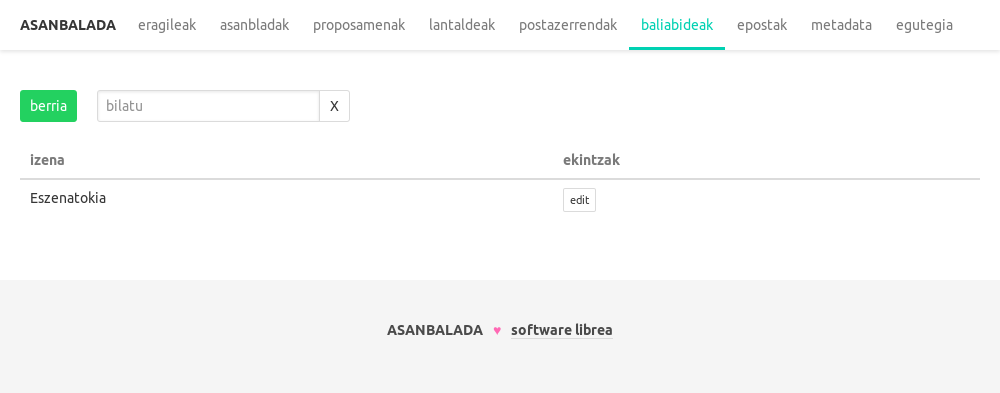

# ASANBALADA
Asabladak kudeatu eta errazteko erreminta (prototipoa).

## Funtzionaltasunak
* Kideen (zein besteen) kontaktu zerrenda
* Asanbladaren akta jasotzeko interfazea
* Aktaren generazio automtikoa
* Proposamenak kudeatzeko interfazea
* Proposamenen informazioa email bidez bidaltzeko aukera
* Lantaldeak
* Baliabideak
* Eposta txantiloiak sortzeko aukera
* Metadata (datu ezberdinak gordetzeko txokoa)
* Posta zerrenda kudeaketa automatikoa (OVH hornitzailearen API bidez).
* Egutegia

## Teknologia
Prototipoa dela kontuan izan. Hainbat gauza ez dira kontuan hartu: ACL, erroreen kudeaketa...

### Zerbitzaria
* node.js
* express (eta bere moduluak)
* sequelize
* sqlite
* nodemailer
* lodash
* bluebird
* moment

### Bezeroa
* vue.js
* lodash
* moment
* axios
* fullcallendar.js (vue-fullcalendar bidez)
* vue-multiselect
* pikaday
* bulma

## Instalazioa
Klonatu git biltegia eta exekutatu `npm install`

## Ingurune aldagaiak
|aldagaia|azalpena|beharrezkoa|berezkoa|eredua|
|---|---|---|---|---|
|ASANBALADA_DB_PATH|sqlite datubase fitxategiaren kokalekua|ez|`./db.sqlite`, proiektuan bertan|/home/erabiltzailea/db.sqlite|
|ASANBALADA_PORT|Asanbalada zerbitzatuko den portua|ez|3000|3000|
|ASANBALADA_OVH_APP_KEY|OVH APIaren APP_KEY|posta zerrendak kudeatu nahi badira|||
|ASANBALADA_OVH_APP_SECRET|OVH APIaren APP_SECRET|posta zerrendak kudeatu nahi badira|||
|ASANBALADA_OVH_APP_CONSUMER_KEY|OVH APIaren APP_CONSUMER_KEY|posta zerrendak kudeatu nahi badira|||
|ASANBALADA_EMAIL|epostak bidaltzeko erabiliko dena|epostak bidali nahi badira||zure@email.org|
|ASANBALADA_EMAIL_PASSWORD|emailaren pasahitza|epostak bidali nahi badira|||
|ASANBALADA_EMAIL_SMTP_SERVER|epostak bidaltzeko zerbitzaria|epostak bidali nahi badira||smtps.google.com|
|ASANBALADA_EMAIL_SENDER_NAME|epostaren bidaltzaile izena|ez|ASANBALADA|Asanblada koordinaketa|
|ASANBALADA_UUID_PREFIX|proposamenen uuid-aren aurrizkia. Proposamen id-a gehitzen zaio (PROP115)|ez|PROP|NIREID|
|ASANBALADA_DEMO|Funtzionaltasun guztiak frogatu postazerrendak benetan kudeatu zein epostak bidali gabe|ez||true|

## Martxan jarri
Beharrezko aldagaiak ezarri eta exekutatu `npm start`:
``` bash
ASANBALADA_DB_PATH=/home/asanbalada/db.sqlite ASANBALADA_OVH_APP_KEY=... ASANBALADA_OVH_APP_SECRET=... ... npm start
```
Frogatzeko nahikoa da ondorengoa exekutatzea:
``` bash
npm run dev
```

## Garatu
Bi zatitan dago banatua: zerbitzaria eta bezeroa.
### Zerbitzaria
``` bash
git clone https://gitlab.com/asanbalada/asanbalada.git
cd asanbalada
npm install
npm run dev
```
### Bezeroa
``` bash
git clone https://gitlab.com/asanbalada/asanbalada-ui.git
cd asanbalada-ui
npm install
npm run dev
```

## Pantaila argazkiak





